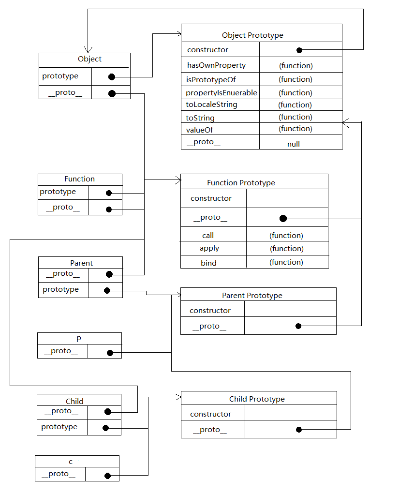
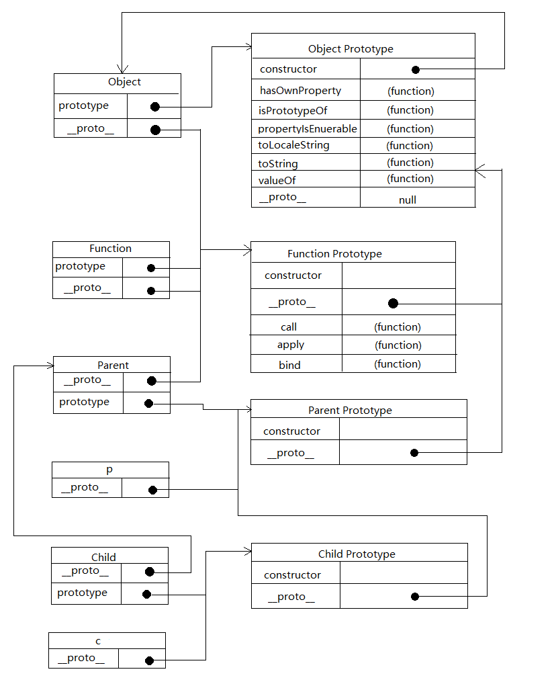

## todo

- 防盗链
- 地域回调
- 专题url
- hash表 散列表
- jquery proxy when
- 文件上传 异步

## 遇过的难题

ajax请求 服务端php setCookie

## scrypt元素的defer async

当浏览器碰到 script 脚本的时候：
1. <script src="script.js"></script>
没有 defer 或 async，浏览器会立即加载并执行指定的脚本，“立即”指的是在渲染该 script 标签之下的文档元素之前，也就是说不等待后续载入的文档元素，读到就加载并执行。
2. <script async src="script.js"></script>
有 async，加载和渲染后续文档元素的过程将和 script.js 的加载与执行并行进行（异步）。
3. <script defer src="myscript.js"></script>
有 defer，加载后续文档元素的过程将和 script.js 的加载并行进行（异步），但是 script.js 的执行要在所有元素解析完成之后，DOMContentLoaded 事件触发之前完成。

此图告诉我们以下几个要点：
    1. defer 和 async 在网络读取（下载）这块儿是一样的，都是异步的（相较于 HTML 解析）
    2. 它俩的差别在于脚本下载完之后何时执行，显然 defer 是最接近我们对于应用脚本加载和执行的要求的
    3. 关于 defer，此图未尽之处在于它是按照加载顺序执行脚本的，这一点要善加利用
    4. async 则是一个乱序执行的主，反正对它来说脚本的加载和执行是紧紧挨着的，所以不管你声明的顺序如何，只要它加载完了就会立刻执行
    5. 仔细想想，async 对于应用脚本的用处不大，因为它完全不考虑依赖（哪怕是最低级的顺序执行），不过它对于那些可以不依赖任何脚本或不被任何脚本依赖的脚本来说却是非常合适的，最典型的例子：Google Analytics

## 短路行为应用于对象
ES的操作符在应用对象时，通常会先调用对象的valueOf()或toString()，以取得可以操作的值
&& || 操作符只会返回其中的某个操作数，短路行为

## event loop


    
    异步编程的4种方法
- 回调函数
- 事件监听
- 发布/订阅
- Promises对象

##setTimeout()参数
```js
function fn(a, b) {
    console.log('setTimout', a, b);
}
setTimeout(fn, 2000, 'aaa', 'bbb');  //setTimout aaa bbb
```


## 一个关于原型的题目

```js
var Func = function(){};
Object.prototype.a = function(){};
Function.prototype.b = function(){};
var f = new Func();

f.a   //function(){}
f.b   //undefined
```


- instanceof运算符

    \<object\> instanceof \<constructor\>
    
    instanceof 运算符用来检测 constructor.prototype 是否存在于参数 object 的原型链上。
    
    ```js
    Object instanceof Function  // true
    Function instanceof Object  // true
    Function instanceof Function // true
    Object instanceof Object      // true
    Func instanceof Function     // true
    Number instanceof Function //true
    Number instanceof Number  // false
    ```
##如何继承
```js
function Parent() {
    this.name = 'aaa';
}
Parent.prototype.sayHello = function () {
    console.log('hello');
}
function Child() {}
```
```js
Child.prototype = new Parent();
Child.prototype.__proto__ = Parent.prototype;
Child.prototype = Object.create(Parent.prototype);
Object.setPrototypeOf(Child.prototype, Parent.prototype);
util.inherits(Child, Parent);  //node中使用 
```

- 情况1

```javascript
let p = new Parent();
Child.prototype = p;
// 或者
Child.prototype = Object.create(Parent.prototype);
```


- 情况2

```javascript
Child.prototype.__proto__ = Parent.prototype;
// 或者
Object.setPrototypeOf(Child.prototype, Parent.prototype);
// 或者 nodejs中util模块
util.inherits(Child, Parent); //子类继承父类的原型上的方法
```




- 情况3

```javascript
class Parent {}
class Child extends Parent{}

```

（1）子类的__proto__属性，表示构造函数的继承，总是指向父类。
（2）子类prototype属性的__proto__属性，表示方法的继承，总是指向父类的prototype属性。



## 运算符优先级


## xss
http://www.cnblogs.com/TankXiao/archive/2012/03/21/2337194.html